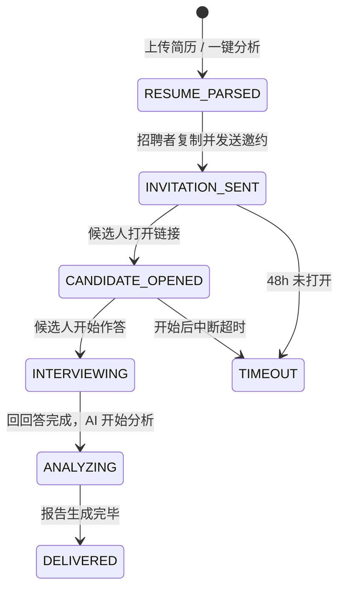

# 电话面试触发流程重设计

## 当前问题

| 问题 | 现状（代码实现） | 期望 |
|------|----------------|------|
| 触发方式 | 点"确认并开始 AI 电面" → **立即拨号** | 生成邀约链接 → 招聘者**转发给候选人** → 候选人主动参与 |
| 匹配度 | StrategyCard 显示"技术栈匹配度 90%" | **删除匹配度**，面试前无法给出准确判断 |
| 候选人尊重 | 候选人被动接到陌生来电 | 候选人收到正式邀约，了解上下文后主动参与 |

---

## 两条触发路径

```
路径 A：上传本地简历                     路径 B：发起 AI 初筛（核心场景）
─────────────────────                  ──────────────────────────────
用户在插件中上传 PDF                      用户在 Boss/智联浏览简历详情页
        ↓                                       ↓
AI 解析简历，提取关键信息                   插件检测到简历页 → 顶部浮现提示条
        ↓                              （姓名 + 「交给艾琳来初面」按钮）
                                                ↓
                                        用户点击「交给艾琳来初面」
        ↓                                       ↓
                    ┌───────────────────────────┐
                    │   生成「AI 初筛邀约卡」      │
                    │  （两条路径汇聚到同一张卡）   │
                    └────────────┬──────────────┘
                                 ↓
                    招聘者点「复制邀约信息」→ 粘贴发送
                                 ↓
                    候选人收到链接 → 打开 H5 页面
                                 ↓
                   文字面试（MVP）/ 语音面试（后续）
                                 ↓
                    AI 分析回答 → 生成报告 → 交付
```

---

## AI 初筛邀约卡（替代原 StrategyCard）

原来的 StrategyCard 做两件事：展示候选人信息 + 触发拨号。新设计把它改为：

### 邀约卡 UI 结构

```
┌─────────────────────────────────────────┐
│  👤  张三 · 高级前端工程师                │
│      本科 · 5年经验 · 29-35K              │
│─────────────────────────────────────────│
│  📋  本次 AI 初筛重点                     │
│      ┌──────┐ ┌──────────┐ ┌─────────┐  │
│      │离职动机│ │React 并发 │ │时间重叠  │  │
11: 1a2f082d-72a2-b281-0081-8b9cad0e1f20: Refactoring game logic into separate module
│─────────────────────────────────────────│
│  ✉️  邀约信息预览                         │
│  ┌─────────────────────────────────────┐│
│  │ 您好，[公司名]诚邀您参加一次简短的    ││
│  │ AI 初筛沟通（约15分钟）。本次沟通将   ││
│  │ 围绕您的项目经历和技术背景展开。      ││
│  │                                     ││
│  │ 👉 点击开始：https://ihr.ai/i/xxxx  ││
│  └─────────────────────────────────────┘│
│                                         │
│       ┌──────────────────────────┐       │
│       │     📋 复制邀约信息        │       │
│       └──────────────────────────┘       │
└─────────────────────────────────────────┘
```

### 关键设计决策

| 决策点 | 方案 | 理由 |
|--------|------|------|
| **删除"匹配度"** | 不再显示百分比 | 面试前无法给出准确判断，误导招聘者 |
| **删除"立即拨号"按钮** | 仅保留「复制邀约信息」一个按钮 | 招聘者自行选择发送渠道（Boss聊天/微信/短信） |
| **邀约文案可编辑** | 默认生成 → 允许微调 | 不同场景话术不同（Boss 聊天 vs 短信 vs 微信） |
| **链接有效期** | 48h，可延期 | 给候选人合理时间，过期自动标记"超时" |

---

## 完整状态流转（修正版）



对应到 `CandidateStatus` 枚举的映射：

| 新状态 | 映射到现有枚举 | 说明 |
|--------|--------------|------|
| RESUME_PARSED | `PENDING_OUTREACH` | 简历已解析，待发送邀约 |
| INVITATION_SENT | `TOUCHED` | 邀约已发出 |
| CANDIDATE_OPENED | `TOUCHED` | 候选人已打开链接 |
| INTERVIEWING | `INTERVIEWING` | 正在面试 |
| ANALYZING | `ANALYZING` | AI 分析中 |
| DELIVERED | `DELIVERED` | 报告已交付 |
| TIMEOUT | `EXCEPTION` | 超时异常 |

---

## 「交给艾琳来初面」场景补充（核心场景）

### 提示条规则

| 规则 | 说明 |
|------|------|
| **何时出现** | 仅当用户当前浏览的页面是简历详情页时才展示（通过 DOM 选择器/URL 匹配检测） |
| **何时消失** | 用户离开简历页（切换到列表页、聊天页等）→ 提示条自动消失 |
| **切换简历** | 用户浏览下一个候选人时，提示条刷新为新的姓名 |
| **不是常驻按钮** | 不在 Side Panel 里放一个永久的“一键分析”入口 |

### Token 节约策略

```
检测是否简历页：DOM 选择器 / URL 匹配       → 0 Token
提取姓名：    正则匹配页面标题或特定 DOM 节点 → 0 Token
提示条展示：  「张三 · [交给艾琳来初面]」            → 0 Token
────────────────────────────────────────────
用户点击按钮后：才抓取简历全文 → 调用 LLM      → 消耗 Token
```

> 浏览 100 份简历但只对 5 人发起初筛，Token 消耗 = 5 份，不是 100 份。

### 操作流程

```
1. 招聘者在 Boss/智联 打开候选人简历详情页
2. 插件检测到简历页（DOM/URL）→ Side Panel 顶部浮现提示条：
   ┌───────────────────────────────┐
   │  张三  ·  [ 交给艾琳来初面 ] │
   └───────────────────────────────┘
3. 点击「交给艾琳来初面」→ 此时才抓取简历全文 → LLM 解析
4. 对话区生成「AI 初筛邀约卡」（含邀约文案 + 复制按钮）
5. 用户点「复制邀约信息」→ 粘贴到 Boss/微信/短信发送
```

---

## 对 EileenSidebar 的改动方向

| 组件 | 当前 | 改为 |
|------|------|------|
| `triggerAnalysisFlow()` | 生成 StrategyCard（含拨号） | 生成 **InvitationCard**（含邀约链接 + 复制按钮） |
| `StrategyCard` | 展示匹配度 + "确认并开始 AI 电面" | 改为 **InvitationCard**：邀约信息预览 + 复制/发送 |
| `CallingCard` | 拨号动画 | **删除或保留为后续语音版预留** |
| `handleExecuteStrategy()` | 模拟拨号 → 4 秒后出结果 | 模拟"邀约已发送" → 状态变为 TOUCHED |
| `ResultCard` | 通话结束后展示结论 | 保留，但改为在候选人完成文字面试后触发 |
